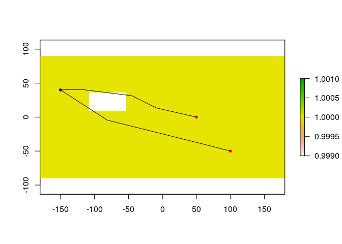

<!-- README.md is generated from README.Rmd. Please edit that file -->

# GeoDist: Constrained distance calculation and associated geotools

<!-- badges: start -->

<!-- badges: end -->

**Work in progress**

This R-package allows the calculation of distances that are contrained
by frontiers, islands, mountains,… Distances are calculated from a
raster grid of the area.  
*From A to B*

``` 
   A     XXX
   |   XXXXXX
   | XXXXXXXX
   |XXXXXXXX
   \ XXXXXX
    \_XX_ _ B
```

These distances can then be implemented in classical geotools like
inverse distance interpolation (`idw.dist`) or kriging with a modified
version of `geoR` functions that accept custom calculated distances
(`variog.dist`, `likfit.dist`, `krige.conv.dist`).

Currently distances are calculated using library `igraph`, but library
`Rvcg` would be much more efficient (I keep that in mind for one day…).

# Download and Install

To download the development version of the `GeoDist` package, type the
following at the R command line:

``` r
install.packages("devtools")  
devtools::install_github("statnmap/GeoDist")
```

Note that spatial libraries like `rgdal` and `sp` may require additional
softwares to be installed on your computer if you work with Mac or
Linux. Look how to install `proj4`, `geos` and `gdal` on your system.

## Example

``` r
library(GeoDist)
#> Loading required package: geoR
#> --------------------------------------------------------------
#>  Analysis of Geostatistical Data
#>  For an Introduction to geoR go to http://www.leg.ufpr.br/geoR
#>  geoR version 1.7-5.2.1 (built on 2016-05-02) is now loaded
#> --------------------------------------------------------------
library(raster)
#> Loading required package: sp
library(sp)

## basic example code
crs_merc <- "+proj=merc +a=6378137 +b=6378137 +lat_ts=0.0 +lon_0=0.0 +x_0=0.0 +y_0=0 +k=1.0 +units=m"
# Create raster
r <- raster(ncol = 20, nrow = 20,
            crs = crs_merc)
values(r) <- 1
values(r)[125:127] <- NA
values(r)[145:147] <- NA
values(r)[165:167] <- NA
plot(r)

# Create points
from_coords <- cbind(-150, 40)
from_sp <- SpatialPointsDataFrame(coords = from_coords, 
                                  data = data.frame(label = "start"),
                                  proj4string = CRS(crs_merc))

to_coords <- matrix(c(50, 0, 100, -50), byrow = TRUE, ncol = 2)
to_sp <- SpatialPointsDataFrame(coords = to_coords, 
                                data = data.frame(label = c("end1", "end2")),
                                proj4string = CRS(crs_merc))


plot(r)
points(from_sp, pch = 20, col = "blue")
points(to_sp, pch = 20, col = "red")

# For "from" and "to" being SpatialPoints
allpath <- dist.obstacle(from = from_sp, to = to_sp, r.ref = r, keep.path = TRUE)
#> step.ang was set to 5 degrees. This conducts to potential error of 0.095178 % of distances calculated.
#> r.ref has been stored in temporary directory: /tmp/RtmpFcgDIi/r.ref.grd

# All path from "from[1,]" to all "to"
lines(allpath$listLines)
```



Please note that the ‘GeoDist’ project is released with a [Contributor
Code of Conduct](CODE_OF_CONDUCT.md). By contributing to this project,
you agree to abide by its terms.
